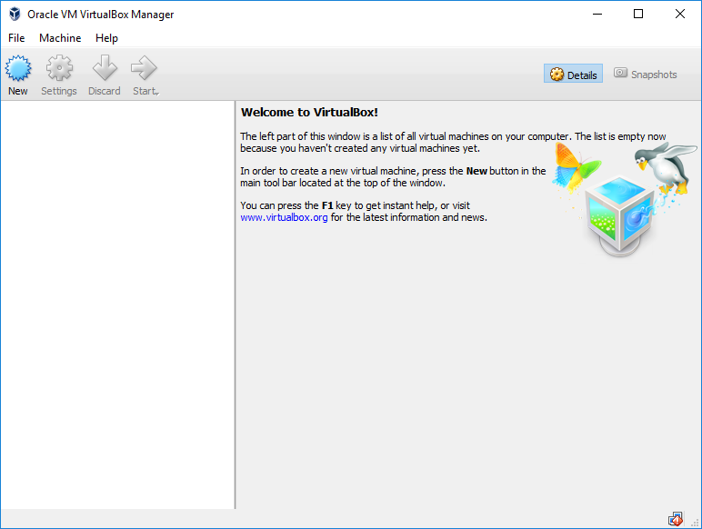
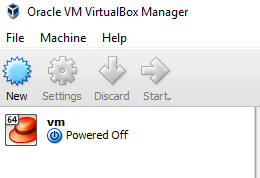
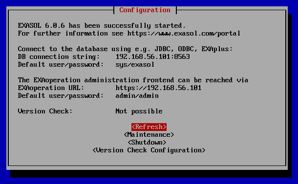
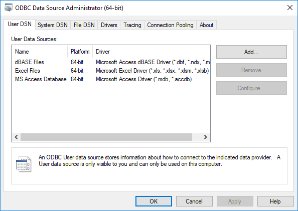
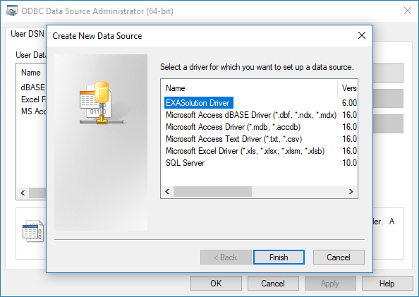
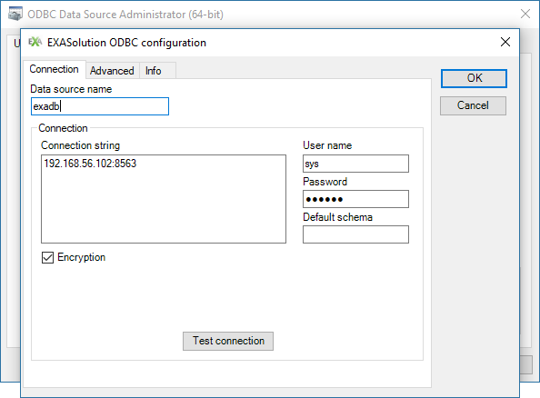
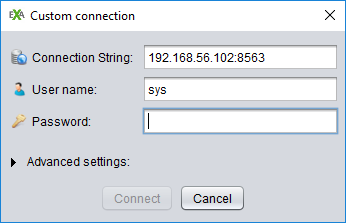

Install Exasol Community Edition on Windows
================
Exasol
March 1st, 2018

-   [Install virtual machine (VM) player](#install-virtual-machine-vm-player)
-   [Run Exasol Community Edition](#run-exasol-community-edition)
-   [Install Exasol ODBC driver](#install-exasol-odbc-driver)
-   [Install EXAplus](#install-exaplus)

The following is a step-by-step guide into installing and configuring the Exasol Community Edition in a Windows environment. It also includes a demonstration on how to configure EXAplus, a GUI for working with EXASolution, and install Exasol ODBC driver for connecting with third-party tools. Note that Exasol Community Edition does not require any high specification machine and since it comes as a virtual machine image you can run it on Windows, macOS or Linux. The installation takes about 10 minutes in which the storage configuration requirements and start of the database are done automatically.

Requirements:

-   x64 Windows, 4GB+ RAM
-   A virtual machine player
-   Exasol Community Edition
-   Exasol ODBC driver
-   EXAPlus

Install virtual machine (VM) player
===================================

This guide uses VirtualBox as a VM player but you can choose your own preferred player. Download and install the latest version of VirtualBox from the official [website](https://www.virtualbox.org/wiki/Downloads). After the installation you can run the VirtualBox Manager.

Run Exasol Community Edition
============================

The next step is to download the free [Exasol Community Edition](https://www.exasol.com/portal/display/DOWNLOAD/Free+Trial) from the official website. Register for the download and you will receive an email with the download link. The download link will prompt to two download options: VM image (.ova file) or ISO image. For the purpose of this tutorial choose the .ova file to run within the VM player. After the download you can double click on the file and you will be prompted to load the VM image into the VM player:

It is important to change the boot order of the VirtualBox to ensure that the VM will boot from the virtual hard drive. To do this go to `Machine` → `Settings…` → `System` → `Motherboard`, uncheck everything except `Hard Disk` and click <kbd>OK</kbd>. Once that is done we can fire up the virtual machine. On the main page select the VM image and click <kbd>Start</kbd>. After the startup you will see the configuration screen that shows the connection string, username and password. This is important information and will be required later when connecting to the database using the EXAplus GUI.

Minimize these windows and keep the VM running during your task.

Install Exasol ODBC driver
==========================

ODBC is a standard interface that allows users to communicate with databases. It can be used to write applications that query data from databases regardless of the environment. It is language independent and provides high performance and memory intensive importing and exporting of data. We need to create a ODBC connection to the Exasol database that lives in our VM. With this connection we will be able to use third-party analytical tools like R/RStudio to connect to the database using their native commands and methods.

First, we need to install the [Exasol ODBC driver](https://www.exasol.com/portal/display/DOWNLOAD/6.0) from the official website. Select the most recent release of Exasol with ODBC driver, go to *Download ODBC Driver* and select the version corresponding to machine specifications (`EXASOL_ODBC-x.x.x-x86_64.msi`). Double-click on the downloaded file and install the driver. Once installed we need to add it to our database connections and configure it. Depending on the version of your Windows OS either go to `Administrative Tools` → `ODBC Data Sources` or search for *ODBC Data Sources*. Select the 64-bit version of the *ODBC Data Source Administrator*. The following window will show up:

By clicking <kbd>Add…</kbd> the following window will appear. If you have properly installed the Exasol ODBC driver it will show up in the list.

After clicking on <kbd>Finish</kbd> the EXASolution ODBC Driver window will appear. Here we need to enter the credentials we got from the Virtual Machine connection as follows:

Now you have a working connection to the Exasol database.

Install EXAplus
===============

EXAplus is a graphical user interface (GUI) that allows the execution of SQL statements in Exasol database. It is implemented in Java and is available as graphical application and simple console version under Windows, macOS and Linux. Download the [latest version](https://www.exasol.com/portal/display/DOWNLOAD/6.0) at the official webpage under *Download Client* by choosing your preferred download option. Double click the downloaded file to proceed with the installation.

After successfully installing the tool you can create a new custom connection by entering the same credentials as above and click <kbd>Connect</kbd>.

You have now successfully connected to the database via EXAplus.

Please refer to the [Exasol User Manual](https://www.exasol.com/portal/display/DOC/User+Manual+6.0?preview=/20056178/22521581/EXASOL_User_Manual-6.0.5-en.pdf) for more detailed information.

Next: [BucketFS Guide](02_bucketfs.md)
