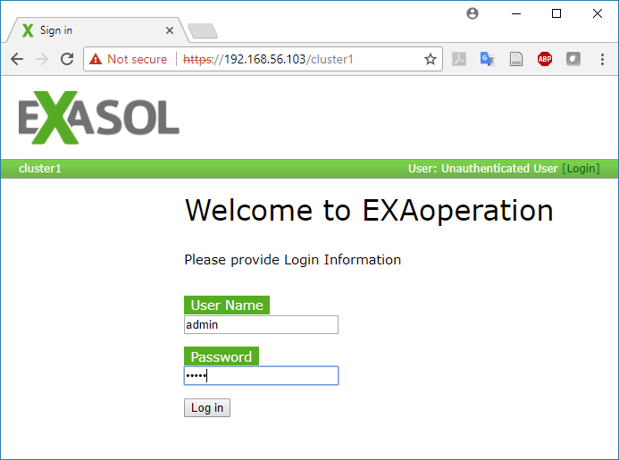
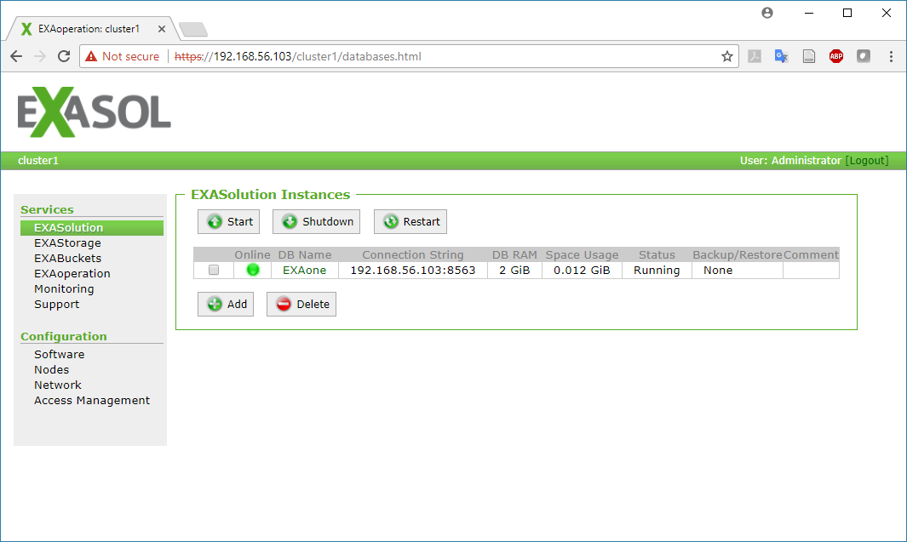
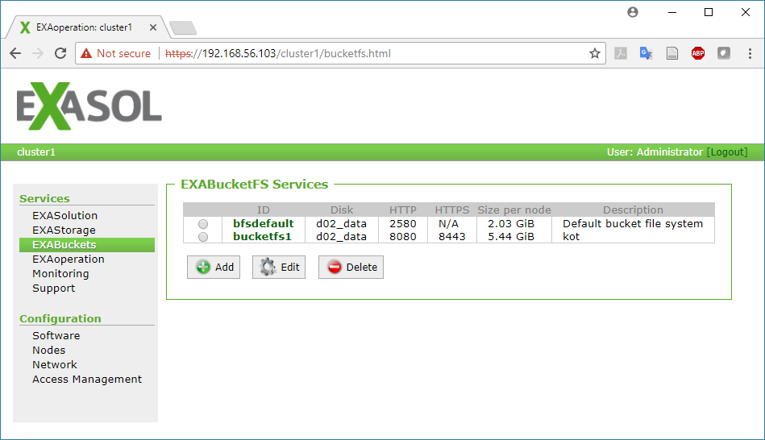
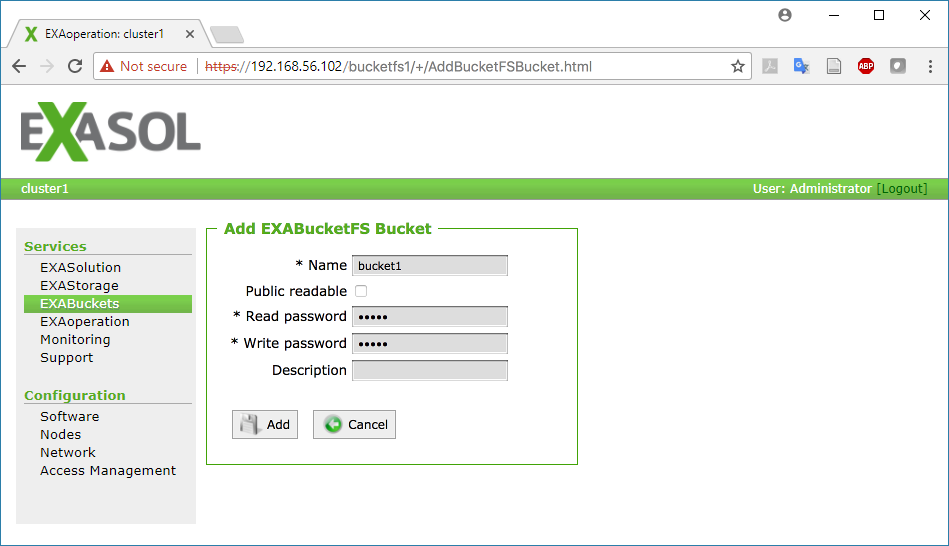
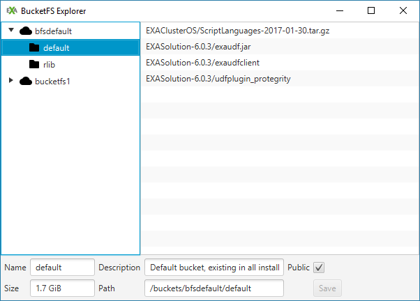

BucketFS Guide
================
Exasol
March 1st, 2018

-   [EXAoperation](#exaoperation)
-   [BucketFS](#bucketfs)
-   [BucketFS Explorer](#bucketfs-explorer)

EXAoperation
============

EXAoperation is an administrative interface which provides all information and configuration settings for the current cluster(s). When you download and start Exasol Community Edition (see *Install EXASOL Community Edition* guide) you can access EXAoperation by typing the DB connection string (192.168.56.102 in this case) in the address bar in your browser and enter *admin* as both username and password.

On the left side there are various sub-menus which provide information on the status of the database, connections, storage, node sizes and BucketFS. In the next section we go into more details on BucketFS.

BucketFS
========

BucketFS deserves a special mention because is an important component (e.g. when running your own analysis via UDFs).

> The BucketFS file system is a synchronous file system which is available in the Exasol cluster. This means that each cluster node can connect to this service (e.g. through the HTTP interface) and will see exactly the same content. ... One BucketFS service contains any number of so-called buckets, and every bucket stores any number of files. ... In contrast to the database itself, BucketFS is a pure file-based system and has no transactional semantic. [Exasol User Manual](https://www.exasol.com/portal/display/DOC/User+Manual+6.0?preview=/20056178/22521581/EXASOL_User_Manual-6.0.5-en.pdf)

You will find a pre-installed default BucketFS service for the configured data disk. If you want to create additional file system services, you need to specify only the data disk and specify ports for HTTP(S). You can create and configure any number of buckets within this BucketFS. Beside the bucket name, you have to specify read/write passwords and define whether the bucket should be publicly readable, i.e. accessible for everyone. A default bucket already exists in the default BucketFS which contains the pre-installed script languages (Java, Python, R). However, for storing larger user data it is highly recommend to create a separate BucketFS instance on a separate partition.

To create a separate BucketFS instance click on the `Add` button and specify the required details. For the exercises described later in this guide, use 8080 for HTTP Port and 8443 for HTTP port. Click <kbd>Add</kbd> to create the new instance which will be automatically named *bucketfs1*.

You also need to create a bucket for within this instance for the exercises. Click on the newly created *bucketfs1* then click on <kbd>Add</kbd>. Specify the new bucket's name as *bucket1* and *exasol* as both the read and write password. Then click <kbd>Add</kbd> again.

BucketFS Explorer
=================

The BucketFS Explorer is a tiny GUI written in Java/JavaFX that helps you working with BucketFS. You can download it from and get more information on [Github](https://github.com/EXASOL/bucketfs-explorer). After starting it, when prompted for the connection details, specify the EXAoperation login information from the *Configuration* screen of the virtual machine.

It is a very handy tool and it allow for managing buckets in a directory structure. By right clicking on a bucket you can easily create and delete buckets as well as their contents. Similarly, you can set read or write passwords. Another important feature is the drag and drop option which allows us to easily upload files into the bucket without the need for curl commands.

Next: [Exasol R Package Guide](03_exasol_r_package.md)
