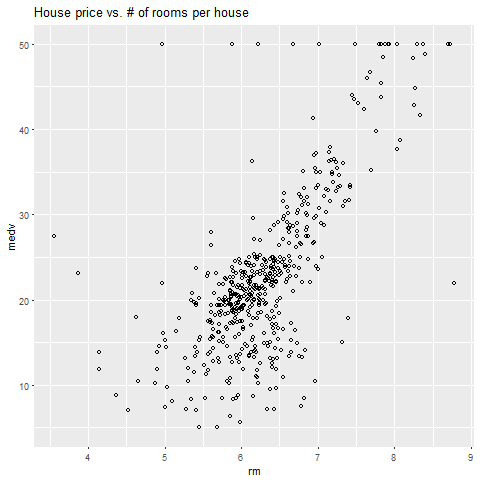

Exasol R Package Guide
================
Exasol
March 1st, 2018

-   [R setup and installation](#r-setup-and-installation)
-   [Connection with Exasol database](#connection-with-exasol-database)
-   [Write Data](#write-data)
-   [Read Data](#read-data)

You can connect to, query from and write into an Exasol database from your R environment. The Exasol R package is optimized for reading and writing data from and to a multinode cluster via `exa.readData()` and `exa.writeData()` functions. You can find the official documentation on the [Github page](https://github.com/EXASOL/r-exasol).

Requirements:

-   [R programming language](https://www.r-project.org/)
-   [RStudio](https://www.rstudio.com/)
-   [Exasol Community Edition](https://www.exasol.com/portal/display/DOWNLOAD/Free+Trial) (see *Install Exasol Community Edition Guide*)
-   [EXAPlus](https://www.exasol.com/portal/display/DOWNLOAD/Version+6.0.5) (see *Install Exasol Community Edition Guide*)
-   ODBC and [Exasol ODBC Driver](https://www.exasol.com/portal/display/DOWNLOAD/Version+6.0.5) (see *Install Exasol Community Edition Guide*)

Once all requirements are met and up and running, the R Exasol package can be installed.

R setup and installation
========================

R Exasol package can be installed via `devtools` package, so make sure to have that installed and loaded beforehand.

``` r
# Install devtools if needed
install.packages("devtools")

# Install package using devtools
devtools::install_github("EXASOL/r-exasol")

# Install (if needed) and load these libraries
library(exasol)   # Exasol package
library(mlbench)  # Library containing the Boston Housing dataset
library(RODBC)    # ODBC connectivity
library(ggplot2)  # Plotting
```

Connection with Exasol database
===============================

First, make sure that the Exasol database (VM) is running. Then a connection with the database can be established via `dbConnect` function. Note that `DBI` package has also a similar function that serves the same purpose. If you also have `DBI` installed, you might need to call the Exasol provided `dbConnect` function by using the `:::` operation in R: `exasol:::dbConnect`.

In the arguments of the `dbConnect` function make sure to specify the correct `exahost`. This is the IP address that connects to the database and might change when you start the virtual machine.

``` r
# Connect to Exasol DB with an ODBC DSN
exaconn <- dbConnect(
    drv     = "exa",                  # EXAdriver object
    exahost = "192.168.56.102:8563",  # IP of database cluster
    uid     = "sys",                  # Username
    pwd     = "exasol")               # Password

# List all tables in Exasol (returns a character vector).
# If your Exasol virtual machine is new, then at this stage there are no user
# tables specified in the database yet, so `dbListTables` will not return anything useful
dbListTables(exaconn)
```

Write Data
==========

Normally, the data will sit in the Exasol database. With the R Exasol package it is very simple to write tables in the database using the `exa.writeData` function. This is a low level function and is faster than `dbWriteTable` function provided by `DBI`.

Before exploring the arguments of `exa.writeData`, some data is loaded in R from the `mlbench` library which contains the BostonHousing dataset.

``` r
# Load some data into R
data("BostonHousing")
```

As Exasol stores data in tables which are in turn organized in schemas, we need to create a schema first for the table we are going to work with. To create a schema in the Exasol database in R we can use the `RODBC` package which implements ODBC database connectivity in R (see `?RODBC` for details)

``` r
# odbcQuery sends a query (in this case a Exasol SQL query) to the database
# Create database schema with the name my_schema 
odbcQuery(exaconn, "CREATE SCHEMA my_schema")

# Open the newly created schema to make it the default container for all subsequent steps below
odbcQuery(exaconn, "OPEN SCHEMA my_schema")

# Create an empty table in my_schema with the name `boston_housing` and specify 
# column names and types as per Exasol standards.
odbcQuery(exaconn,
    "CREATE OR REPLACE TABLE boston_housing(
         crim     DOUBLE, 
         zn       DOUBLE, 
         indus    DOUBLE, 
         chas     VARCHAR(10),
         nox      DOUBLE, 
         rm       DOUBLE, 
         age      DOUBLE,
         dis      DOUBLE,
         rad      DOUBLE,
         tax      DOUBLE,
         ptratio  DOUBLE,
         b        DOUBLE,
         lstat    DOUBLE,
         medv     DOUBLE
     )")
```

The database now contains a new schema and table with its column names. To populate the columns with the actual data `exa.writeData` is used. In the arguments specify the connection, source data set name and the table name.

``` r
# Finally write the data into Exasol
exa.writeData(exaconn, data = BostonHousing, tableName = "boston_housing")

# Check again the list of tables contained in the Exasol database
dbListTables(exaconn)
```

Read Data
=========

In a similar fashion we can read data from the Exasol database using the `exa.readTable` function. As in the writing of data scenario, this is the faster alternative to `dbReadTable` function. In the arguments specify the connection and query to be executed which pulls the data from the database.

``` r
# Read table from the Exasol database into the data.frame object called boston_housing_exasol
boston_housing_exasol = exa.readData(exaconn, "SELECT * FROM boston_housing")
```

As it can be seen it is the same data we transferred to the Exasol database. A plot of the MEDV (median house value) vs RM (rooms per house) is shown below:

``` r
bhplot = ggplot(BostonHousing, aes(rm, medv)) + 
         geom_point(colour = "black", shape = 1) +
         ggtitle("House price vs. # of rooms per house")

plot(bhplot)
```



When done, clean up and close the database connection.

``` r
# Drop schema and the table it contains
odbcQuery(exaconn, "DROP SCHEMA my_schema CASCADE")

# Disconnect
dbDisconnect(exaconn)
```

Next: [Train and predict via UDFs](04_train_predict_UDFs.md)
